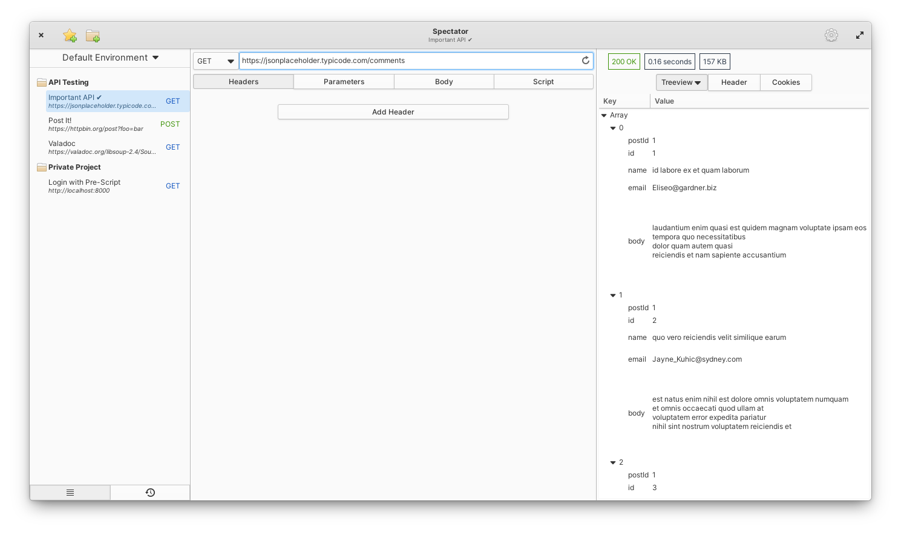

# Spectator

Spectator is a native application written in Vala using GTK. It's enables you to test the
API endpoints of your HTTP server.

## Download

## Features

- [x] Do requests to a web server
- [x] Handle Basic Proxy Server
- [x] Scripting capabilities
- [x] Create collections of requests
- [ ] Create request enviroments
- [ ] Create test enviroments for your collections

Right now Spectator allows you to make single requests to a web endpoint. In the long run
it shall give you to give you the ability to create enviroments and collections to make
your workflow more fluent.

## Building, Testing, and Installation

You'll need the following dependencies:
* meson
* libgee-0.8-dev
* libgranite-dev
* libgtksourceview-3.0-dev
* libwebkit2gtk-4.0-dev
* libjson-glib-dev
* libxml2-dev
* libsqlite3
* libhandy-1-dev
* duktape-dev
* valac

Run `meson build` to configure the build environment. Change to the build directory and run `ninja test` to build

    meson build --prefix=/usr
    cd build
    ninja

To install, use `ninja install`, then execute with `com.github.treagod.spectator`

    sudo ninja install
    com.github.treagod.spectator
