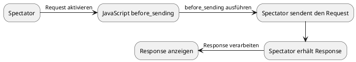

# Scripting

Spectator gibt dem Benutzer die Möglichkeit, seine Requests durch Skripterstellung zu erweitern. Die in Spectator verwendete Skriptsprache ist JavaScript. Zur Ausführung
von den Skripten wird die einbettbare JavaScript Engine [Duktape](https://duktape.org/) verwendet. Fast alle der bereitgestellten APIs führen nativen Code aus.

Das Skript wird zu einem bestimmten Zeitpunkt unmittelbar vor der Ausführung der Spectator-Anforderung ausgeführt. In Zukunft soll es einen Callback geben, um den Response abzufangen.



## console
Das `console` Objekt stellt Methoden bereit, um auf die Spectator Konsole zu schreiben.


### log(any)
Schreibt unformatierten Text auf die Konsole.
### warning(any)
Schreibt gelben Text auf die Konsole.
### error(any)
Schreibt roten Text auf die Konsole.

## HTTP
The HTTP object provides methods to make additional requests during your Spectator request operation. The objects methods are the same
as HTTP methods (GET, POST,...).
Das HTTP Objekt stellt Methoden zur Verfügung, um zusätzliche Requests zum Spectator Request zu machen. Die Methoden entsprechen den
HTTP Methoden (GET, POST,..).

> **Note:** Die Methode für die HTTP `delete` Methode heißt `destroy`, da `delete` ein Keyword in JavaScript ist.

Alle Methoden benötigen einen string Argument, welches eine valide URL sein muss, und ein optionales Konfigurations Objekt.

Nachdem der HTTP Request abgeschlossen ist wird entweder ein Response Objekt zurückgegeben oder `undefined`, falls der Request fehlgeschlagen ist.

### get(url[, config]) : Response?

### post(url[, config]) : Response?

### put(url[, config]) : Response?

### patch(url[, config]) : Response?

### destroy(url[, config]) : Response?

> ***Beispiel:***
```javascript
function before_sending(request) {
  var res = HTTP.get("https://httpbin.org/get");
}
```

### Konfigurations Objekt für HTTP
Das Konfigurations Objekt konfiguriert den HTTP request. Es besteht aus mehreren Feldern, welche alle optional sind.

> **Note:** Weil die HTTP requests noch nicht Nebenläufig sind wird empfohlen ein `timeout` zu definieren. Ansonsten kann es passieren, dass die Anwendung nicht mehr reagiert.

#### headers : Object
Das `headers` Feld ist ein Objekt welches aus string-string Paaren besteht. Die definierten Header werden dem JavaScript Request hinzugefügt.

#### timeout : string|number
Setzt einen timeout für den HTTP Request.

#### body
Fügt dem HTTP Request ein Body hinzu. Dieses Feld wird von HTTP Methoden, die keinen Body haben, ignoriert (z.B. GET).

Das Feld `body` hat zwei Subfelder, `type` und `data`.

Das Feld `type` muss entweder `ContentType.Json`, `ContentType.UrlEncoded` oder `ContentType.FormData` zugewiesen werden.

Das `data` Feld erwartet ein einfaches JavaScript Objekt. Falls `type` `ContentType.Json` ist, wird das komplette Feld *stringifiziert*. Hier ist die Tiefe des Objekts nicht relevant.
Falls `type` `ContentType.UrlEncoded` oder `ContentType.FormData` ist muss das Objekt aus string-string Paaren bestehen.

> ***Beispiel:***
```javascript
function before_sending(request) {
  var res = HTTP.post("http://localhost:8000/login", {
    "headers": {
      "foo:" "bar"
    }
    "timeout": 10,
    "body": {
      "type": ContentType.Json,
      "data": {
        "username": "admin",
        "password": "password"
      }
    }
  });
}
```

##### ContentType
Dieses Objekt enthält Definitionen für den `Content-Type` des Requests. Aktuell existieren nur die Typen `Json`, `UrlEncoded` und `FormData`.

## Request
Das Request Objekt ist genau dasselbe Objekt aus der Spectator Anwendung. Die Felder des Objekts können nur gelesen werden, Änderungen der Felder hat keine Auswirkung.
Die `add_header` Methode erlaubt es temporär zusätzliche Header dem Request Objekt hinzufügen, also bis der Spectator Request abgeschlossen ist.

### name : string
Der Name des Requests.

### uri : string
Die URI des Requests

### method : string
Die Methode des Requests.

### headers : Objekt<string, string>
Die Header des des Requests

### add_header (key : string, value :string)
Fügt temporär ein Header dem Request hinzu.

> ***Beispiel:***
```javascript
function before_sending(request) {
  request.add_header("forgot", "some header");
}
```
### abort ()
Bricht den aktuellen Spectator Request ab. Das heißt, dass auch alle Script Befehle abgebrochen werden.

> ***Example:***
```javascript
function before_sending(request) {
  var res = HTTP.post("http://localhost:8000/important");
  if (!res) {
    request.abort (); // Aborts the real request
  }
}
```

## Response
Das Response Objekt welches nach dem Request verfügbar ist.

### status : number
### headers : Array<string, string>
### data : string
