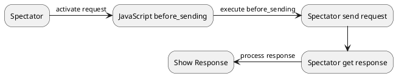
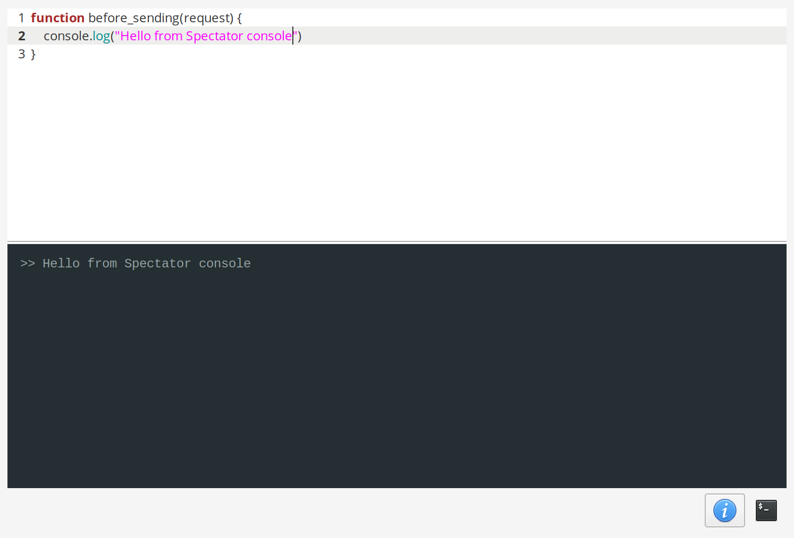

# Scripting

Spectator gives the user the ability to augment their requests with scripting. The scripting language used in Spectator is JavaScript. For execution
of the scripts the emedabble JavaScript engine [Duktape](https://duktape.org/) is used. Most of the provided API maps to native code.

The script is executed at a certain point, right before the execution of the Spectator request. In future there shall be a callback for intercepting the
Spectator response object.



## console
The console currently binds only the `log` method, which is for printing on the Spectator JavaScript console.



### log(any)

## HTTP
The HTTP object provides methods to make additional requests during your Spectator request operation. The objects methods are the same
as HTTP methods (GET, POST,...).

> **Note:** The corresponding HTTP `delete` method is named `destroy` because delete is a keyword in JavaScript.

All methods take a mandatory URL string as first parameter and an optional config object as second parameter.

When the HTTP request is finished it returns either a response object or undefined if the request failed.

### get(url[, config]) : Response?

### post(url[, config]) : Response?

### put(url[, config]) : Response?

### patch(url[, config]) : Response?

### destroy(url[, config]) : Response?

> ***Example:***
```javascript
function before_sending(request) {
  var res = HTTP.get("https://httpbin.org/get");
}
```

## Config Object for HTTP

The config object configures the HTTP requests. It consists only of fields which are all optional to set.

> **Note:** As the HTTP requests are not concurrent right now it is recommended to set at least the timeout field so your application won't freeze to death.

### headers : Object
The headers field is an object which currently consists of string-string pairs. All headers defined here will be added the the HTTP request

### timeout : string|number
Sets the timeout for the HTTP request

### body
Sets the HTTP body for the request. This field will be ignored when the HTTP method has no body (e.g. GET).

The `body` has two fields, `type` and `data`.

The `type` has to be assigned with either `ContentType.Json`, `ContentType.UrlEncoded` or `ContentType.FormData`.

The `data` field expects a plain object. When the type is `ContentType.Json` the object will be stringified, so nested depth of the object does not matter.
When the type is `ContentType.UrlEncoded` or `ContentType.FormData` the object must consists of string-string pairs.

> ***Example:***
```javascript
function before_sending(request) {
  var res = HTTP.post("http://localhost:8000/login", {
    "headers": {
      "foo:" "bar"
    }
    "timeout": 10,
    "body": {
      "type": ContentType.Json,
      "data": {
        "username": "admin",
        "password": "password"
      }
    }
  });
}
```

## ContentType
The content type object defines the ContentType of the request. Currently there are only `Json`, `UrlEncoded` and `FormData`

ContentType should be set for the `type` field of the `body` field in the config object.

## Request
The request objects directly maps to the request item which is sent. The attributes in the script are read only.
The `add_header` method allows to temporarily, i.e. until the request has finished, add headers to the request.

### name : string
Name of the request. The name is of type string.
>  This property is read only
### uri : string
URI of the request. The URI is of type string.
>  This property is read only
### method : string
Method of the request. The method is of type string.
>  This property is read only
### headers
Headers of request. The methods is an object with string-string key-value pairs.
>  This property is read only
### add_header (key, value)
Temporarily adds a header to the request. `key` and `value` are of type string
> ***Example:***
```javascript
function before_sending(request) {
  request.add_header("forgot", "some header");
}
```
### abort ()
Aborts the request sending action, i.e. the script and the actual request are aborted.

> ***Example:***
```javascript
function before_sending(request) {
  var res = HTTP.post("http://localhost:8000/important");
  if (!res) {
    request.abort (); // Aborts the real request
  }
}
```

## Response
The response object is available after a request has successfully finished.

### status : number
### headers : Array<string, string>
### data : string
